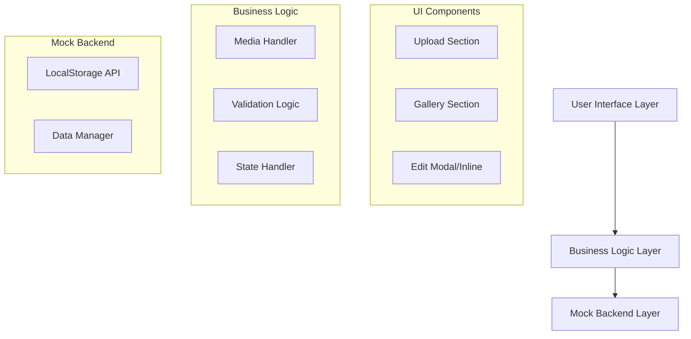

# Design Document: MediaMix Hub

## Overview

MediaMix Hub is a single-page web application that provides an intuitive interface for managing media files. The application follows a frontend-first architecture with a mock backend layer that can be seamlessly replaced with Azure services. The design emphasizes clean UI patterns, responsive layout, and maintainable code structure that supports future backend integration.

The application consists of two main UI sections: an Upload Section for adding new media and a Gallery Section for viewing and managing existing media. All functionality is contained within a single page to provide a cohesive user experience.

## Architecture

### High-Level Architecture



### Frontend-First Approach

The architecture is designed to support easy backend replacement:

1. **Abstraction Layer**: All backend interactions go through async functions that can be swapped
2. **Data Consistency**: Mock backend maintains the same data structures as planned Azure APIs
3. **Error Handling**: Consistent error patterns that match real API responses
4. **State Management**: UI state is separate from data persistence logic

## Components and Interfaces

### Upload Section Component

**Purpose**: Handles file selection, metadata input, and upload processing

**Interface**:
```javascript
interface UploadSection {
  fileInput: HTMLInputElement
  descriptionInput: HTMLInputElement
  uploadButton: HTMLButtonElement
  
  handleFileSelect(event: Event): void
  handleUpload(): Promise<void>
  clearForm(): void
  showValidationError(message: string): void
}
```

**Key Features**:
- File type validation (images, videos, audio)
- Description input with character limits
- Visual feedback during upload process
- Form clearing after successful upload
- Error messaging for invalid inputs

### Gallery Section Component

**Purpose**: Displays media items in an organized, responsive layout

**Interface**:
```javascript
interface GallerySection {
  container: HTMLElement
  
  renderGallery(mediaItems: MediaItem[]): void
  renderMediaCard(item: MediaItem): HTMLElement
  showEmptyState(): void
  handleEdit(itemId: string): void
  handleDelete(itemId: string): void
}
```

**Layout Strategy**:
- CSS Grid for responsive card layout
- Flexible columns that adapt to screen size
- Card-based design for each media item
- Consistent spacing and visual hierarchy

### Edit Interface Component

**Purpose**: Provides inline or modal editing for media descriptions

**Interface**:
```javascript
interface EditInterface {
  showEditMode(item: MediaItem): void
  hideEditMode(): void
  saveChanges(itemId: string, newDescription: string): Promise<void>
  cancelEdit(): void
}
```

**Implementation Options**:
- Inline editing: Replace description text with input field
- Modal editing: Overlay dialog for focused editing experience
- Auto-save or explicit save/cancel actions

## Data Models

### MediaItem Model

```javascript
interface MediaItem {
  id: string              // Unique identifier (UUID or timestamp-based)
  fileName: string        // Original file name with extension
  description: string     // User-provided description
  uploadDate: string      // ISO 8601 formatted date string
  fileType: 'image' | 'video' | 'audio'  // Categorized file type
  fileSize?: number       // Optional: file size in bytes
  thumbnailUrl?: string   // Optional: for future thumbnail generation
}
```

### Storage Schema

```javascript
interface MediaStorage {
  mediaItems: MediaItem[]
  lastUpdated: string
  version: string         // For future migration support
}
```

**LocalStorage Key Structure**:
- Primary key: `mediamix_hub_data`
- Backup key: `mediamix_hub_backup` (for data recovery)

## Mock Backend Implementation

### Storage Strategy

**LocalStorage vs In-Memory Array Decision**:
- **LocalStorage**: Chosen for data persistence between sessions
- **Fallback**: In-memory array if localStorage is unavailable
- **Benefits**: User data survives browser refresh, better development experience

### API Abstraction Layer

```javascript
// Mock Backend API - designed to match future Azure API structure
class MockBackendAPI {
  async createMedia(mediaData: Omit<MediaItem, 'id'>): Promise<MediaItem>
  async getMedia(): Promise<MediaItem[]>
  async updateMedia(id: string, updates: Partial<MediaItem>): Promise<MediaItem>
  async deleteMedia(id: string): Promise<void>
}
```

### Future Azure Integration Points

```javascript
// Future Azure API calls will replace mock implementations
async function createMedia(data) {
  // CURRENT: Mock implementation
  return mockBackend.createMedia(data);
  
  // FUTURE: Azure Logic App integration
  // return fetch('https://<logic-app-url>/api/media', {
  //   method: 'POST',
  //   body: JSON.stringify(data)
  // });
}
```

### Data Consistency Patterns

- **Optimistic Updates**: UI updates immediately, rollback on error
- **Error Handling**: Consistent error response format
- **Loading States**: Async operation feedback patterns
- **Data Validation**: Client-side validation matching server-side rules

## User Interface Design

### Layout Structure

```
┌─────────────────────────────────────┐
│              Header                 │
├─────────────────────────────────────┤
│           Upload Section            │
│  [File Input] [Description] [Upload]│
├─────────────────────────────────────┤
│           Gallery Section           │
│  ┌─────┐ ┌─────┐ ┌─────┐ ┌─────┐   │
│  │ Med │ │ Med │ │ Med │ │ Med │   │
│  │ ia  │ │ ia  │ │ ia  │ │ ia  │   │
│  │  1  │ │  2  │ │  3  │ │  4  │   │
│  └─────┘ └─────┘ └─────┘ └─────┘   │
│  ┌─────┐ ┌─────┐                   │
│  │ Med │ │ Med │                   │
│  │ ia  │ │ ia  │                   │
│  │  5  │ │  6  │                   │
│  └─────┘ └─────┘                   │
└─────────────────────────────────────┘
```

### Responsive Design Patterns

**Desktop (1200px+)**:
- 4-5 columns in gallery grid
- Horizontal upload section layout
- Larger media cards with more detail

**Tablet (768px - 1199px)**:
- 2-3 columns in gallery grid
- Stacked upload section elements
- Medium-sized media cards

**Mobile (< 768px)**:
- Single column gallery layout
- Vertical upload section
- Full-width media cards

### Visual Design Principles

**Clean Interface Guidelines**:
- Minimal color palette with clear contrast
- Consistent spacing using 8px grid system
- Typography hierarchy with clear information architecture
- Subtle shadows and borders for depth without clutter

**Interaction Feedback**:
- Hover states for interactive elements
- Loading spinners for async operations
- Success/error messaging with appropriate colors
- Smooth transitions for state changes

## Error Handling

### Client-Side Validation

**File Upload Validation**:
- File type restrictions (images: jpg, png, gif; videos: mp4, webm; audio: mp3, wav)
- File size limits (configurable, default 10MB)
- Description length validation (1-500 characters)
- Duplicate file name handling

**Error Display Patterns**:
- Inline validation messages near form fields
- Toast notifications for system-level errors
- Modal dialogs for critical errors requiring user action
- Clear error recovery instructions

### Mock Backend Error Simulation

```javascript
// Simulate realistic error conditions
const mockErrors = {
  STORAGE_FULL: 'Storage quota exceeded',
  INVALID_FILE_TYPE: 'File type not supported',
  NETWORK_ERROR: 'Connection failed, please try again',
  VALIDATION_ERROR: 'Invalid data provided'
};
```

### Error Recovery Strategies

- **Retry Logic**: Automatic retry for transient errors
- **Data Recovery**: Backup/restore from localStorage
- **Graceful Degradation**: Fallback to in-memory storage if localStorage fails
- **User Guidance**: Clear instructions for resolving errors

## Testing Strategy

### Dual Testing Approach

The application will use both unit tests and property-based tests to ensure comprehensive coverage:

**Unit Tests**: Focus on specific examples, edge cases, and integration points
**Property Tests**: Verify universal properties across all inputs using a property-based testing library

### Property-Based Testing Configuration

- **Library**: fast-check (JavaScript property-based testing library)
- **Test Iterations**: Minimum 100 iterations per property test
- **Test Tagging**: Each property test references its design document property
- **Tag Format**: `// Feature: media-mix-hub, Property {number}: {property_text}`

### Testing Categories

**Unit Testing Focus**:
- Component rendering with specific data
- Form validation with known inputs
- Error handling with simulated failures
- LocalStorage operations with mock data
- UI interactions with specific user actions

**Property Testing Focus**:
- Data consistency across CRUD operations
- UI state management with random inputs
- Storage operations with generated data
- Form validation with random invalid inputs
- Gallery rendering with various data sets

## Correctness Properties

*A property is a characteristic or behavior that should hold true across all valid executions of a system—essentially, a formal statement about what the system should do. Properties serve as the bridge between human-readable specifications and machine-verifiable correctness guarantees.*

### Property 1: File Type Validation
*For any* file input, the system should accept files with valid MIME types (image/*, video/*, audio/*) and reject files with invalid MIME types
**Validates: Requirements 1.1**

### Property 2: Input Capture Consistency  
*For any* text input in the description field, the captured value should exactly match the user's input
**Validates: Requirements 1.2**

### Property 3: Media Creation Completeness
*For any* valid file and description combination, uploading should result in a new MediaItem being created with all required fields (id, fileName, description, uploadDate, fileType) properly populated
**Validates: Requirements 1.3**

### Property 4: Form State Management
*For any* successful upload operation, the upload form should be cleared and the gallery should be updated to include the new item
**Validates: Requirements 1.5**

### Property 5: Gallery Data Consistency
*For any* set of stored media items, the gallery should display exactly those items with all required information (filename, description, upload date) visible
**Validates: Requirements 2.1, 2.2**

### Property 6: UI Reactivity
*For any* successful CRUD operation (create, update, delete), the gallery display should immediately reflect the changes without requiring manual refresh
**Validates: Requirements 2.3, 3.4, 4.2**

### Property 7: Edit Interface Activation
*For any* media item, clicking the edit button should activate an editable interface for that specific item's description
**Validates: Requirements 3.1**

### Property 8: Description Update Persistence
*For any* media item and new description, confirming an edit should permanently update the stored MediaItem with the new description
**Validates: Requirements 3.2**

### Property 9: Edit Cancellation Safety
*For any* media item being edited, canceling the edit operation should restore the original description without any changes to the stored data
**Validates: Requirements 3.3**

### Property 10: Edit State Exclusivity
*For any* media item currently being edited, attempting to edit the same item should be prevented until the current edit is completed or canceled
**Validates: Requirements 3.5**

### Property 11: Data Cleanup Completeness
*For any* media item, deleting it should remove all traces of the item from storage with no orphaned data remaining
**Validates: Requirements 4.1, 4.3**

### Property 12: Deletion Cancellation Safety
*For any* media item, if deletion confirmation is implemented and the user cancels, the original item should remain completely unchanged in storage and display
**Validates: Requirements 4.4**

### Property 13: API Response Format Consistency
*For any* mock backend function call, the returned data should match the exact schema format expected from future Azure API responses
**Validates: Requirements 5.3, 6.3**

### Property 14: CRUD Operation Consistency
*For any* sequence of CRUD operations performed during a session, the system should maintain consistent data state with no corruption or inconsistencies
**Validates: Requirements 5.4**

### Property 15: Session Persistence
*For any* data stored using localStorage, the same data should be retrievable in subsequent browser sessions
**Validates: Requirements 5.5**

### Property 16: Async Operation Handling
*For any* asynchronous operation, the system should properly manage loading states and handle both success and error conditions gracefully
**Validates: Requirements 6.4**